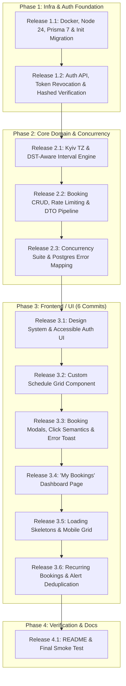

# Technical Specification & Architectural Blueprint
## Office Meeting Room Booking Web Application

---

## 1. System Architecture & Pinned Technology Stack

### 1.1 Pinned Technology Stack

| Layer | Selected Technology | Version / Engine | Technical Rationale & Advantages |
| :--- | :--- | :--- | :--- |
| **Runtime** | **Node.js** | `24.x LTS` (or `22.x LTS`) | Active Long-Term Support release in 2026. Pinned in Dockerfile, `.nvmrc`, and `package.json` (`"engines": { "node": ">=22.0.0" }`). |
| **Framework** | **Next.js** | `16.x` (App Router) | Active LTS release of Next.js providing unified React Server Components and Route Handlers. Eliminates CORS issues, unifies full-stack TypeScript, and builds into a single Docker image. |
| **UI Library** | **React** | `19.x` | Modern React runtime supporting Server Actions, optimized hook performance, and concurrent rendering. |
| **Language** | **TypeScript** | `5.x` (Strict Mode) | End-to-end type safety shared across database models, API request/response DTOs, and UI components. |
| **Database** | **PostgreSQL** | `16.x` | Production-grade RDBMS supporting `citext`, `btree_gist`, ACID transactions, and **Partial GiST Exclusion Constraints** to guarantee DB-level race condition protection. |
| **ORM** | **Prisma ORM** | `7.x` | Prisma 7 client configuration via `prisma.config.ts`, `@prisma/adapter-pg` driver adapter, declarative migrations, and custom generated client path. |
| **Authentication** | **Custom JWT + HttpOnly Cookies** | `jsonwebtoken` + `bcryptjs` | Secure session management resistant to XSS. `bcryptjs` with cost factor 10. Includes `tokenVersion` revocation in DB (logout-all-devices). |
| **Timezone Utility** | **`date-fns-tz`** | `3.x` | Canonical timezone library for accurate timezone conversions and DST-aware calculations (`Europe/Kyiv` local time $\leftrightarrow$ UTC timestamps). |
| **Styling** | **Tailwind CSS + Pure CSS Grid** | `3.4.x` / Vanilla CSS Grid | Utility-first styling for responsive layouts and custom CSS Grid layout for the weekly schedule without third-party calendar libraries. |
| **Testing** | **Vitest + Supertest** | `4.x` | Lightning-fast TypeScript test runner for unit, API integration, and concurrent race-condition test suites (`npm test`). Includes fake timer support (`vi.useFakeTimers()`). |
| **DevOps** | **Docker & Docker Compose** | Compose v2 | Single-command orchestration (`docker-compose up --build`) provisioning PostgreSQL container and application service with automated healthchecks. |

---

## 2. Database Schema & Integrity Constraints

### 2.1 Prisma 7 Schema (`prisma/schema.prisma`)

```prisma
datasource db {
  provider = "postgresql"
}

generator client {
  provider = "prisma-client"
  output   = "../src/generated/client"
}

enum BookingStatus {
  ACTIVE
  CANCELLED
}

model User {
  id                            String                    @id @default(uuid())
  email                         String                    @unique @db.Citext // Case-insensitive email uniqueness
  name                          String
  passwordHash                  String
  isEmailVerified               Boolean                   @default(false)
  verificationTokenHash         String?                   @unique // SHA-256 hash of verification token
  verificationTokenExpires      DateTime?                 @db.Timestamptz(3)
  tokenVersion                  Int                       @default(1) // Token version for instant JWT revocation (logout all devices)
  createdAt                     DateTime                  @default(now()) @db.Timestamptz(3)
  updatedAt                     DateTime                  @updatedAt @db.Timestamptz(3)
  
  bookings                      Booking[]                 @relation("UserBookings")
  cancelledBookings             Booking[]                 @relation("UserCancelledBookings")

  @@map("users")
}

model Room {
  id                            String                    @id @default(uuid())
  name                          String                    @unique
  floor                         Int
  capacity                      Int
  createdAt                     DateTime                  @default(now()) @db.Timestamptz(3)
  updatedAt                     DateTime                  @updatedAt @db.Timestamptz(3)
  bookings                      Booking[]

  @@map("rooms")
}

model Booking {
  id                            String                    @id @default(uuid())
  title                         String
  startTime                     DateTime                  @db.Timestamptz(3) // UTC timestamp with explicit timezone type
  endTime                       DateTime                  @db.Timestamptz(3) // UTC timestamp with explicit timezone type
  status                        BookingStatus             @default(ACTIVE)
  cancelledAt                   DateTime?                 @db.Timestamptz(3)
  cancelledByUserId             String?
  roomId                        String
  userId                        String
  
  // Recurring booking support (Bonus)
  recurringSeriesId             String?                   // UUID linking all instances of a recurring series
  recurrenceIndex               Int?                      // Index within series (1..N)

  createdAt                     DateTime                  @default(now()) @db.Timestamptz(3)
  updatedAt                     DateTime                  @updatedAt @db.Timestamptz(3)

  room                          Room                      @relation(fields: [roomId], references: [id], onDelete: Cascade)
  user                          User                      @relation("UserBookings", fields: [userId], references: [id], onDelete: Cascade)
  cancelledByUser               User?                     @relation("UserCancelledBookings", fields: [cancelledByUserId], references: [id], onDelete: SetNull)

  // DB Performance Indexes for real read paths
  @@index([roomId, startTime])                            // Optimized for GET /api/bookings?roomId=&weekStart=
  @@index([userId, startTime])                            // Optimized for GET /api/bookings/my
  @@index([recurringSeriesId])
  @@map("bookings")
}

model NotificationDeliveryLog {
  id                            String                    @id @default(uuid())
  bookingId                     String
  userId                        String
  sentAt                        DateTime                  @default(now()) @db.Timestamptz(3)

  @@unique([bookingId, userId])
  @@map("notification_delivery_logs")
}
```

### 2.2 Prisma 7 Configuration (`prisma.config.ts` & `src/lib/db.ts`)

```typescript
// prisma.config.ts
import { defineConfig } from "@prisma/config";

export default defineConfig({
  schema: "./prisma/schema.prisma",
  datasource: {
    provider: "postgresql",
    url: process.env.DATABASE_URL,
  },
});

// src/lib/db.ts
import { PrismaClient } from "../generated/client";
import { PrismaPg } from "@prisma/adapter-pg";
import { Pool } from "pg";

const connectionString = process.env.DATABASE_URL;
const pool = new Pool({ connectionString, max: 10 });
const adapter = new PrismaPg(pool);

const globalForPrisma = globalThis as unknown as { prisma: PrismaClient };

export const prisma = globalForPrisma.prisma || new PrismaClient({ adapter });

if (process.env.NODE_ENV !== "production") globalForPrisma.prisma = prisma;
```

### 2.3 Migration Execution Order & Raw SQL Constraints (`prisma/migrations/20260729000000_init/migration.sql`)

Initial migration pre-loads `citext` and `btree_gist` **BEFORE** table creation, followed by partial exclusion, cancellation consistency, and session-independent timezone check constraints:

```sql
-- 1. Enable required PostgreSQL extensions FIRST
CREATE EXTENSION IF NOT EXISTS citext;
CREATE EXTENSION IF NOT EXISTS btree_gist;

-- 2. Create Tables (Users, Rooms, Bookings generated by Prisma)
-- ... [Prisma Table Creation SQL] ...

-- 3. Add Partial Exclusion Constraint: Only ACTIVE bookings must not overlap
-- Range '[)' allows back-to-back bookings (e.g. 10:00-11:00 and 11:00-12:00)
ALTER TABLE "bookings"
ADD CONSTRAINT "no_overlapping_bookings"
EXCLUDE USING gist (
  "roomId" WITH =,
  tstzrange("startTime", "endTime", '[)') WITH &&
) WHERE ("status" = 'ACTIVE');

-- 4. Add CHECK constraint: Cancellation Consistency
ALTER TABLE "bookings"
ADD CONSTRAINT "booking_cancellation_consistency"
CHECK (
  ("status" = 'ACTIVE' AND "cancelledAt" IS NULL AND "cancelledByUserId" IS NULL) OR
  ("status" = 'CANCELLED' AND "cancelledAt" IS NOT NULL AND "cancelledByUserId" IS NOT NULL)
);

-- 5. Add CHECK constraints for Entity Field Bounds
ALTER TABLE "rooms" ADD CONSTRAINT "room_capacity_positive" CHECK ("capacity" > 0);
ALTER TABLE "users" ADD CONSTRAINT "user_name_length" CHECK (length(trim("name")) BETWEEN 1 AND 50);
ALTER TABLE "bookings" ADD CONSTRAINT "booking_title_length" CHECK (length(trim("title")) BETWEEN 1 AND 100);

-- 6. Add CHECK constraint: Start time must be strictly before End time
ALTER TABLE "bookings"
ADD CONSTRAINT "booking_start_before_end"
CHECK ("startTime" < "endTime");

-- 7. Add CHECK constraint: Booking duration bounds (30 mins <= duration <= 4 hours)
ALTER TABLE "bookings"
ADD CONSTRAINT "booking_duration_bounds"
CHECK (
  "endTime" - "startTime" >= INTERVAL '30 minutes' AND
  "endTime" - "startTime" <= INTERVAL '4 hours'
);

-- 8. Add Session-Independent CHECK constraint: 30-minute granularity alignment in UTC
ALTER TABLE "bookings"
ADD CONSTRAINT "booking_30min_alignment"
CHECK (
  EXTRACT(MINUTE FROM ("startTime" AT TIME ZONE 'UTC')) IN (0, 30) AND
  EXTRACT(SECOND FROM ("startTime" AT TIME ZONE 'UTC')) = 0 AND
  EXTRACT(MINUTE FROM ("endTime" AT TIME ZONE 'UTC')) IN (0, 30) AND
  EXTRACT(SECOND FROM ("endTime" AT TIME ZONE 'UTC')) = 0
);
```

---

## 3. Concurrency Architecture & Two-Tier Protection

### 3.1 Two-Tier Safeguard Architecture

```
                                Client Request
                                      │
                                      ▼
                        ┌───────────────────────────┐
                        │   Tier 1: API Validation  │
                        │ (Friendly 409 JSON Error) │
                        └─────────────┬─────────────┘
                                      │
                                      ▼
                        ┌───────────────────────────┐
                        │   Tier 2: DB GiST Exclude │
                        │  (Physical Lock & Block)  │
                        └─────────────┬─────────────┘
                                      │
                 ┌────────────────────┴────────────────────┐
                 │                                         │
        Success (Row Inserted)                 Violation Error (23P01)
                 │                                         │
                 ▼                                         ▼
         HTTP 201 Created                         HTTP 409 Conflict
```

1. **Tier 1 (Application API Pre-Check):** Fast checks for user feedback (future time `startTime > NOW()`, 30m–4h duration, office hours 09:00–19:00 Kyiv, email verification status).
2. **Tier 2 (PostgreSQL Partial GiST Exclusion Constraint):** If two concurrent requests pass Tier 1 simultaneously, PostgreSQL enforces `no_overlapping_bookings`. Exactly one transaction succeeds (`HTTP 201`); the second fails with PostgreSQL code `23P01` (exclusion_violation). The API catches `23P01` and returns a clean `HTTP 409 Conflict` response (`SLOT_OVERLAP`).

---

## 4. DST-Aware Timezone & Schedule Grid Contract

### 4.1 Canonical Timezone Rules & DST Recurrence Engine
- **Canonical Timezone Library:** `date-fns-tz` (v3.x) is pinned as the single timezone engine across backend and frontend.
- **Office Reference Timezone:** Fixed to `Europe/Kyiv` (UTC+2 in winter, UTC+3 in summer).
- **Office Working Hours:** `09:00` to `19:00` in `Europe/Kyiv` local time.
- **DST Shift QA Scenarios:** Spring Forward on **March 29, 2026** (UTC+2 $\rightarrow$ UTC+3); Fall Back on **October 25, 2026** (UTC+3 $\rightarrow$ UTC+2). These are QA test cases; the `date-fns-tz` engine dynamically resolves DST for any future year.
- **Recurring Booking Generation Rule:** Weekly recurrence MUST preserve local Kyiv wall-clock time (e.g. 10:00 Kyiv time every Tuesday). For each occurrence $k \in \{1..K\}$, the system constructs the local wall-clock date in `Europe/Kyiv` at `10:00:00`, then converts that specific local wall-clock instant into its corresponding UTC timestamp.

### 4.2 API DST-Aware Half-Open Week Range Contract (`GET /api/bookings`)
- **Query Parameter:** `weekStart` (Format: `YYYY-MM-DD`, e.g. `2026-08-03`).
- **Explicit Kyiv Monday Normalization & Date Range Query:**
  ```typescript
  import { toZonedTime, fromZonedTime } from "date-fns-tz";
  import { startOfWeek, addWeeks } from "date-fns";

  // Parse input date in Europe/Kyiv, normalize to Monday of that week
  const parsedDate = toZonedTime(`${weekStart}T00:00:00`, "Europe/Kyiv");
  const mondayKyiv = startOfWeek(parsedDate, { weekStartsOn: 1 }); // 1 = Monday
  const weekStartKyiv = fromZonedTime(mondayKyiv, "Europe/Kyiv");
  const weekEndKyiv = fromZonedTime(addWeeks(mondayKyiv, 1), "Europe/Kyiv");

  const bookings = await prisma.booking.findMany({
    where: {
      roomId,
      status: "ACTIVE",
      startTime: {
        gte: weekStartKyiv,
        lt: weekEndKyiv,
      },
    },
    orderBy: { startTime: "asc" },
  });
  ```

### 4.3 UI Grid Axis Labels & Cell Click Contract
- **Grid Axis Definition:**
  - **Horizontal Axis:** Represents Kyiv Office Business Days (Monday through Sunday).
  - **Vertical Axis:** Displays Kyiv Office Working Hours (09:00 to 19:00 Kyiv Time).
- **Slot Cell Label & Click Semantics:**
  - Inside each slot cell, a badge displays the converted user local time bounds (e.g., Kyiv `09:00–09:30` renders badge `"02:00–02:30 EDT"` for New York users).
  - Clicking a slot passes the exact **UTC ISO 8601 instant** associated with that Kyiv slot (e.g. `2026-08-03T06:00:00.000Z`), NEVER a string parsed from the client's local display badge!
- **UI Header Banner Notice:** An explicit notice informs the user:
  `"Grid columns display Kyiv Office Days (Mon–Sun, 09:00–19:00 Kyiv Time). Slot badges are translated to your local timezone (America/New_York)."`

---

## 5. Security, Authentication & Multi-Stage Rate Limiting

### 5.1 Input Sanitization & Validation Rules
- **Email:** `email.trim().toLowerCase()`, valid email format, max 255 chars.
- **User Name:** `name.trim()`, non-empty, min 1, max 50 chars. Rejects whitespace-only string.
- **Password:** 8 to 72 bytes. Hashed using `bcryptjs` with cost factor 10.
- **Booking Title:** `title.trim()`, non-empty, 1 to 100 characters. Rejects whitespace-only string. Sanitized against XSS injection.

### 5.2 Multi-Stage Deterministic Request Pipeline

Requests pass through **6 distinct stages in strict order**:

```
 ┌────────────────────────────────────────────────────────┐
 │ Stage 1: Pre-Auth IP Rate Limiting                     │
 │ 429 RATE_LIMITED (Unauthenticated endpoints)           │
 └───────────────────────────┬────────────────────────────┘
                             │
 ┌───────────────────────────▼────────────────────────────┐
 │ Stage 2: Authentication & CSRF Validation              │
 │ 401 UNAUTHORIZED / 403 CSRF_VALIDATION_FAILED          │
 └───────────────────────────┬────────────────────────────┘
                             │
 ┌───────────────────────────▼────────────────────────────┐
 │ Stage 3: Post-Auth User Rate Limiting                  │
 │ 429 RATE_LIMITED (Authenticated endpoints by userId)   │
 └───────────────────────────┬────────────────────────────┘
                             │
 ┌───────────────────────────▼────────────────────────────┐
 │ Stage 4: Input Shape & Resource Validation             │
 │ 400 INVALID_INPUT / 404 ROOM_NOT_FOUND                 │
 └───────────────────────────┬────────────────────────────┘
                             │
 ┌───────────────────────────▼────────────────────────────┐
 │ Stage 5: Business Rules & Verification                 │
 │ 403 EMAIL_NOT_VERIFIED / 400 BOOKING_IN_PAST / DURATION│
 └───────────────────────────┬────────────────────────────┘
                             │
 ┌───────────────────────────▼────────────────────────────┐
 │ Stage 6: Database Execution & Concurrency             │
 │ 409 SLOT_OVERLAP (Postgres 23P01)                      │
 │ 409 EMAIL_EXISTS (Postgres 23505)                      │
 └────────────────────────────────────────────────────────┘
```

### 5.3 High-Entropy Verification Token, CSRF & Logout Policy
- **High-Entropy Generation:** `crypto.randomBytes(32).toString("hex")` (64-char hex string with 256 bits of entropy).
- **Hashed Token Storage:** `verificationTokenHash` stored as SHA-256 hash in DB. Token expires in 24 hours. Resend invalidates old token and is throttled to 1 request per 60 seconds per user.
- **CSRF Posture:** For mutating routes (`POST`, `PUT`, `DELETE`), middleware validates `Origin` or `Referer` headers against application `Host`. **If both Origin and Referer are absent, the request is REJECTED with HTTP 403 Forbidden (`CSRF_VALIDATION_FAILED`)**.
- **Logout Policy (Logout All Devices):** Calling `POST /api/auth/logout` clears the cookie AND increments `user.tokenVersion` in the DB. This instantly invalidates all active JWT tokens across all devices for that user account (`HTTP 401 Unauthorized`).

---

## 6. Complete API Endpoint Contracts & DTO Schemas

### 6.1 Comprehensive Endpoint Matrix

| Endpoint | Method | Auth Required | Request Body / Params | Success Status | Error Responses |
| :--- | :--- | :--- | :--- | :---: | :--- |
| `/api/auth/register` | `POST` | No | `RegisterDto` | **201** | `400 INVALID_INPUT`, `409 EMAIL_EXISTS` |
| `/api/auth/login` | `POST` | No | `LoginDto` | **200** | `401 INVALID_CREDENTIALS` |
| `/api/auth/logout` | `POST` | Yes | None | **200** | `401 UNAUTHORIZED` |
| `/api/auth/me` | `GET` | Yes | None | **200** | `401 UNAUTHORIZED` |
| `/api/auth/verify-email` | `GET` | No | Query: `token` | **200** | `400 INVALID_OR_EXPIRED_TOKEN` |
| `/api/auth/resend-verification` | `POST` | Yes | None | **200** | `401 UNAUTHORIZED`, `429 RATE_LIMITED` |
| `/api/rooms` | `GET` | Yes | Query: `capacity?` | **200** | `401 UNAUTHORIZED` |
| `/api/bookings` | `GET` | Yes | Query: `roomId`, `weekStart` | **200** | `400 INVALID_WEEK_START`, `404 ROOM_NOT_FOUND` |
| `/api/bookings` | `POST` | Yes | `CreateBookingDto` | **201** | `400 BOOKING_IN_PAST`, `INVALID_DURATION`, `403 EMAIL_NOT_VERIFIED`, `409 SLOT_OVERLAP` |
| `/api/bookings/:id` | `DELETE` | Yes | Query: `mode=single\|series` | **200** | `400 CANNOT_CANCEL_PAST_BOOKING`, `403 NOT_BOOKING_OWNER`, `404 BOOKING_NOT_FOUND` |
| `/api/bookings/my` | `GET` | Yes | Query: `tab=upcoming\|past`, `page=1`, `limit=10` | **200** | `401 UNAUTHORIZED` |

### 6.2 Data Transfer Object (DTO) Definitions

```typescript
// Unified Error Payload
export interface ApiErrorResponse {
  error: string;
  message: string;
  details?: Record<string, string[]> | null;
}

// Auth DTOs
export interface RegisterDto {
  email: string;      // Trimmed, lowercase, valid email
  name: string;       // Trimmed 1..50 chars
  password: string;   // 8..72 bytes
}

export interface LoginDto {
  email: string;
  password: string;
}

export interface UserDto {
  id: string;
  email: string;
  name: string;
  isEmailVerified: boolean;
  createdAt: string;  // ISO 8601 UTC
}

// Booking DTOs
export interface CreateBookingDto {
  roomId: string;             // Valid UUIDv4
  title: string;              // Trimmed 1..100 chars
  startTime: string;          // ISO 8601 UTC string (30-min aligned, future only)
  endTime: string;            // ISO 8601 UTC string (30-min aligned, 30m..4h duration)
  isRecurring?: boolean;      // If true, recurrenceCount is required (2..12)
  recurrenceCount?: number;   // 1..12 (If isRecurring is false/omitted, count defaults to 1)
}

export interface BookingDto {
  id: string;
  title: string;
  startTime: string;          // ISO 8601 UTC string
  endTime: string;            // ISO 8601 UTC string
  status: "ACTIVE" | "CANCELLED";
  roomId: string;
  userId: string;
  userName: string;
  isMine: boolean;
  recurringSeriesId?: string | null;
  recurrenceIndex?: number | null;
}

export interface PaginatedResponseDto<T> {
  data: T[];
  pagination: {
    page: number;
    limit: number;
    totalItems: number;
    totalPages: number;
  };
}
```

### 6.3 Booking Cancellation Rules & History Semantics
- **Past Booking Cancellation:** **STRICTLY PROHIBITED**. Attempting to delete a booking where `startTime < NOW()` returns **HTTP 400 Bad Request** (`CANNOT_CANCEL_PAST_BOOKING`).
- **"My Bookings" Tab Filtering:**
  - **"Upcoming Bookings" Tab:** Displays active bookings (`status = ACTIVE` AND `startTime >= NOW()`).
  - **"Past Bookings" Tab:** Displays past bookings (`startTime < NOW()`) AND all cancelled bookings (`status = CANCELLED`), styled with a clear red `CANCELLED` status badge.

---

## 7. QA Authorization, Boundary & UI/UX Test Matrices

### 7.1 Authentication & Authorization Matrix

| Endpoint | Unauthenticated | Expired JWT | Deleted User | Unverified User | Verified Non-Owner | Verified Owner |
| :--- | :---: | :---: | :---: | :---: | :---: | :---: |
| `POST /api/auth/register` | 201 / 409 | N/A | N/A | N/A | N/A | N/A |
| `POST /api/auth/login` | 200 / 401 | N/A | N/A | N/A | N/A | N/A |
| `GET /api/auth/me` | **401** | **401** | **401** | 200 | 200 | 200 |
| `GET /api/rooms` | **401** | **401** | **401** | 200 | 200 | 200 |
| `GET /api/bookings` | **401** | **401** | **401** | 200 | 200 | 200 |
| `POST /api/bookings` | **401** | **401** | **401** | **403 `EMAIL_NOT_VERIFIED`** | 201 / 409 | 201 / 409 |
| `DELETE /api/bookings/:id` | **401** | **401** | **401** | **403 `EMAIL_NOT_VERIFIED`** | **403 `NOT_BOOKING_OWNER`** | **200 OK** |

### 7.2 Booking Boundary Test Cases (QA Suite Requirements)

| Test ID | Scenario Description | Input Parameters | Expected Result |
| :--- | :--- | :--- | :--- |
| **BND-01** | Exact opening time booking | `09:00 - 09:30 Kyiv` | **201 Created** |
| **BND-02** | Exact closing slot booking | `18:30 - 19:00 Kyiv` | **201 Created** |
| **BND-03** | Ending at closing time | `endTime = 19:00 Kyiv` | **201 Created** |
| **BND-04** | Exceeding closing time | `18:30 - 19:30 Kyiv` | **400 OUTSIDE_OFFICE_HOURS** |
| **BND-05** | Start time in past | `startTime < NOW()` | **400 BOOKING_IN_PAST** |
| **BND-06** | End before start | `startTime = 11:00, endTime = 10:00` | **400 INVALID_DURATION** |
| **BND-07** | Same start and end | `10:00 - 10:00` | **400 INVALID_DURATION** |
| **BND-08** | Duration < 30 minutes | 15 minute duration | **400 INVALID_DURATION** |
| **BND-09** | Duration > 4 hours | 4 hours 30 mins duration | **400 INVALID_DURATION** |
| **BND-10** | Non-30-min alignment | `10:15 - 10:45` | **400 UNALIGNED_TIME_SLOT** |
| **BND-11** | Spring Forward DST Week | March 29, 2026 week | **201 Created** (Verified against UTC shift) |
| **BND-12** | Fall Back DST Week | October 25, 2026 week | **201 Created** (Verified against UTC shift) |
| **BND-13** | Malformed Room UUID | `roomId = "invalid-uuid"` | **400 INVALID_INPUT** |
| **BND-14** | Non-Monday `weekStart` | `weekStart = "2026-08-05"` (Wednesday) | **200 OK** (Auto-normalized to Monday Aug 3) |
| **BND-15** | Cancel past booking | Delete booking where `startTime < NOW()` | **400 CANNOT_CANCEL_PAST_BOOKING** |

### 7.3 UI/UX Quality & Accessibility Requirements
- **Long-Title Truncation & Tooltips:** Slot blocks truncate long titles using CSS `text-overflow: ellipsis` with `overflow: hidden`. Hovering or clicking a slot opens a popover displaying full title, booker name, and exact time bounds.
- **Text Escaping & XSS Prevention:** All user-provided text (`title`, `name`) is rendered safely via React default JSX text escaping.
- **Modal Dialog Accessibility:** Modals implement `role="dialog"`, `aria-modal="true"`, focus trapping, `Escape` key close handler, and backdrop click handler. Submit buttons enter `disabled` state showing a loading spinner during active API requests to prevent double-submit UI bugs.
- **Schedule Auto-Refresh UI Recovery:** Upon receiving a `409 Conflict` error, the UI automatically refetches the room schedule to replace stale grid state with up-to-date bookings. Creating or deleting a booking triggers an immediate optimistic update or background schedule refetch.
- **Multi-Device Notification Delivery:** In-app alert notifications use the server-side `NotificationDeliveryLog` table (`bookingId`, `userId`, `sentAt`) combined with `localStorage` fallback to guarantee single-trigger delivery across all user devices.

---

## 8. Performance, Load Criteria & Concurrency Suite

### 8.1 System Load Criteria & Performance Benchmarks
- **Test Dataset:** 10 Rooms, 1,000 Users, 50,000 Bookings in database.
- **Throughput Benchmark:** $\ge 500\text{ schedule reads / minute}$.
- **Response Latency Target:** p95 latency $\le 150\text{ ms}$ for `GET /api/bookings`.
- **Connection Timeout Handling:** Requests waiting $> 5000\text{ ms}$ for a DB connection timeout return **HTTP 503 Service Unavailable** (`DATABASE_TIMEOUT`).
- **Database Connection Pool:** Prisma Client singleton with max 10 connections.

### 8.2 Concurrency Test Suite (`npm run test:concurrency`)

| Test Suite | Scenario | Setup | Expected Result |
| :--- | :--- | :--- | :--- |
| **CONC-01** | **Same Room, Same Slot** | 50 concurrent `POST` requests for Room 1, `10:00–10:30`. | **Exactly 1 x 201 Created**, **49 x 409 Conflict**. |
| **CONC-02** | **Same Room, Adjacent Slots** | 2 concurrent `POST` requests: User A `10:00–11:00`, User B `11:00–12:00`. | **2 x 201 Created** (Back-to-back allowed). |
| **CONC-03** | **Different Rooms, Same Slot** | 2 concurrent `POST` requests for Room 1 & Room 2 at `10:00–10:30`. | **2 x 201 Created** (Independent rooms). |
| **CONC-04** | **Recurring Series Partial Conflict** | Booking 8-week series when Week 3 slot is taken. | **Transaction rolls back entirely**, returns **409 Conflict** identifying Week 3. |
| **CONC-05** | **Double Click Submit** | User double-clicks "Book" button sending 2 identical requests within 5ms. | **1 x 201 Created**, **1 x 409 Conflict**. |

---

## 9. Database Maintenance & Postgres Error Code Mapping

### 9.1 PostgreSQL Error Code & Constraint Mapping Matrix

| Postgres Error Code | Database Constraint Name | API Error Code String | HTTP Status |
| :--- | :--- | :--- | :---: |
| `23P01` | `no_overlapping_bookings` | `SLOT_OVERLAP` | **409** |
| `23505` | `users_email_key` / `users_verificationTokenHash_key` | `EMAIL_EXISTS` / `TOKEN_EXISTS` | **409** |
| `23514` | `booking_30min_alignment` | `UNALIGNED_TIME_SLOT` | **400** |
| `23514` | `booking_duration_bounds` | `INVALID_DURATION` | **400** |
| `23514` | `booking_start_before_end` | `INVALID_DURATION` | **400** |
| `23514` | `booking_cancellation_consistency` | `INVALID_CANCELLATION_STATE` | **400** |
| `23514` | `room_capacity_positive` | `INVALID_ROOM_CAPACITY` | **400** |
| `57P01` / `57014` | Connection pool / query timeout | `DATABASE_TIMEOUT` | **503** |

### 9.2 Test Environment & Seed Data Strategy
- **Isolated Test DB:** Tests run against a dedicated database `book_meet_test` defined in `.env.test`.
- **Relative-Date Seed Script:** Seed data generates dates relative to `NOW()` (e.g. `NOW() + 1 day`), preventing seed decay over time.
- **Fake Timers:** Vitest integration tests use `vi.useFakeTimers()` to test past/future time boundaries deterministically.

---

## 10. End-to-End Development Roadmap & Git Release Plan



---

### PHASE 1: Project Setup, Infrastructure & Base Backend Foundation

#### Release 1.1: Project Scaffold, Docker & Database Setup with Extension Pre-loading
- **Goal:** Establish repo structure, pinned Node 24 LTS, Next.js 16/React 19 scaffold, Prisma 7 with `@prisma/adapter-pg`, containerization, and initial SQL migration.
- **Tasks:**
  - Initialize Next.js 16 (App Router), React 19, TypeScript 5, and Tailwind CSS. Pin Node 24 LTS in `.nvmrc` and `package.json` engines.
  - Create `docker-compose.yml` configuring PostgreSQL 16 container, env variables, and healthchecks.
  - Configure `prisma.config.ts`, `src/lib/db.ts`, and `prisma/schema.prisma` with `@db.Timestamptz(3)` and `@db.Citext` (`User`, `Room`, `Booking`, `NotificationDeliveryLog`).
  - Create initial migration `prisma/migrations/20260729000000_init/migration.sql` pre-loading `citext` and `btree_gist` extensions **BEFORE** table creation, followed by partial `no_overlapping_bookings` exclusion constraint, cancellation consistency check, capacity check, duration check (30m–4h), and UTC 30-min alignment checks.
  - Write relative-date `prisma/seed.ts` populating 5 rooms, 2 verified test users (`admin@office.com`, `user@office.com`), and initial demo bookings.
- **Commit Message:** `feat(infra): setup Next.js 16, Node 24, Prisma 7 schema, and initial SQL migration with citext & GiST`

#### Release 1.2: Authentication API, Token Revocation & Secure Email Verification
- **Goal:** User authentication, password hashing, JWT cookie security with `tokenVersion` revocation (logout-all-devices), high-entropy hashed email verification, and auth tests.
- **Tasks:**
  - Implement `bcryptjs` (cost factor 10) password hashing and JWT utility including `tokenVersion`.
  - Build `POST /api/auth/register` generating `crypto.randomBytes(32)` tokens and storing SHA-256 hashes.
  - Build dev email console logger for verification links.
  - Build `GET /api/auth/verify-email` and `POST /api/auth/resend-verification` (rate limited to 1/min).
  - Build `POST /api/auth/login`, `POST /api/auth/logout` (incrementing `tokenVersion`), and `GET /api/auth/me`.
  - Write Vitest 4.x unit/integration tests for auth matrix scenarios.
- **Commit Message:** `feat(auth): add JWT auth with token revocation, hashed email verification, and auth matrix tests`

---

### PHASE 2: Full Backend API, Core Domain Logic, Concurrency & Test Suite

#### Release 2.1: DST-Aware Kyiv Timezone & Half-Open Interval Engine
- **Goal:** Core domain utility functions for timezone conversions and half-open interval overlap checks.
- **Tasks:**
  - Implement `utils/timezone.ts` using `date-fns-tz` for UTC $\leftrightarrow$ `Europe/Kyiv` conversions, DST shift handling, and 09:00–19:00 office hours validation.
  - Implement `utils/interval.ts` for half-open interval collision math `[StartA, EndA)`.
  - Write Vitest 4.x unit tests covering all boundary and collision scenarios including March 29 & October 25 DST weeks.
- **Commit Message:** `feat(domain): implement DST-aware interval engine and Kyiv timezone validation with unit tests`

#### Release 2.2: Booking CRUD API, Multi-Stage Pipeline & DTO Contract
- **Goal:** RESTful API endpoints for room schedule fetching and booking lifecycle management.
- **Tasks:**
  - Build `GET /api/rooms` (with optional `capacity` query filter).
  - Build `GET /api/bookings` accepting `roomId` and `weekStart` with DST-safe half-open query `[weekStartKyiv, weekStartKyiv + 7 days)` and auto-Monday normalization using `startOfWeek`.
  - Build `POST /api/bookings` with 6-stage pipeline (pre-auth IP rate limit, CSRF origin check, post-auth user rate limit, input DTO validation, email verification check, future-only check `startTime > NOW()`, duration & office hours check).
  - Build `DELETE /api/bookings/:id` enforcing strict user ownership and soft-cancellation (`status = CANCELLED`, `cancelledAt`, `cancelledByUserId`). Reject past cancellation attempts (`CANNOT_CANCEL_PAST_BOOKING`).
  - Build `GET /api/bookings/my` with upcoming/past filtering and capped pagination (`limit <= 50`).
  - Write boundary tests (BND-01 through BND-15).
- **Commit Message:** `feat(api): implement room schedule endpoints, multi-stage pipeline, and DTO contracts`

#### Release 2.3: PostgreSQL Error Mapping & Concurrency Test Suite
- **Goal:** Verify physical database race condition protection under concurrent request loads.
- **Tasks:**
  - Implement error handler mapping PostgreSQL error `23P01` to `409 SLOT_OVERLAP` and `23514` to constraint-specific codes (`UNALIGNED_TIME_SLOT`, `INVALID_DURATION`, `INVALID_CANCELLATION_STATE`).
  - Write expanded concurrency test suite (`CONC-01` through `CONC-05`) verifying 50 simultaneous requests, adjacent slots, recurring conflicts, and double-clicks.
- **Commit Message:** `test(concurrency): verify PostgreSQL GiST exclusion constraint under full concurrency suite`

---

### PHASE 3: Frontend / UI Implementation (Modular Commit Breakdown)

#### Release 3.1: Design System, Layout & Auth UI
- **Goal:** UI theme foundation, global navigation, and authentication views.
- **Tasks:**
  - Set up Tailwind color palette, glassmorphic container utilities, and global typography.
  - Build responsive `Navbar` with user profile info, email verification badge, and logout.
  - Create `/login`, `/register`, and `/verify-email` pages with field-level validation and error toasts.
  - Implement `AuthContext` providing persistent session state.
- **Commit Message:** `feat(ui): add design system, navigation bar, auth pages, and email verification status UI`

#### Release 3.2: Custom Weekly Schedule Grid Component
- **Goal:** Pure CSS Grid schedule calendar component.
- **Tasks:**
  - Build `ScheduleGrid` with 7-day horizontal axis (anchored to Kyiv Office Days) and 30-minute vertical time axis (09:00 to 19:00 Kyiv Time).
  - Add week navigation controls (Previous, Next, Today).
  - Add timezone indicator badge (displaying user local timezone alongside `Europe/Kyiv` office hours notice).
  - Render booked slot blocks with title, user name, and distinct visual badges for own vs others' bookings.
- **Commit Message:** `feat(ui): implement custom CSS Grid weekly schedule calendar view`

#### Release 3.3: Interactive Booking Creation & Cancellation Modals
- **Goal:** Grid slot interaction for booking creation and cancellation dialogs with accessibility.
- **Tasks:**
  - Add click-to-book handler on empty grid slots passing UTC ISO instant to `CreateBookingModal`.
  - Implement duration dropdown (30m to 4h) and title input with XSS escaping and long-title truncation.
  - Block booking modal submit button if user email is unverified with banner linking to resend email.
  - Implement modal accessibility (`aria-modal`, focus trap, Escape key handler, disabled loading state).
  - Add `CancelBookingModal` confirmation dialog for soft-cancelling owned bookings.
  - Connect toast notification system for server error feedback (409 Conflict, 403 Forbidden) and auto-refetch schedule.
- **Commit Message:** `feat(ui): add accessible booking modal, click semantics, cancel dialog, and auto-refetch`

#### Release 3.4: "My Bookings" Dashboard Page
- **Goal:** User management page for personal booking history.
- **Tasks:**
  - Build `/my-bookings` route with tabs: "Upcoming Bookings" & "Past Bookings".
  - Display upcoming active bookings with direct "Cancel" buttons.
  - Display past bookings and cancelled bookings (with red status badges) with pagination / load more.
  - Add click-through link on booking cards to open that room's schedule grid on the corresponding week.
- **Commit Message:** `feat(ui): build My Bookings dashboard page with upcoming/past tabs and grid navigation links`

#### Release 3.5: UX Polish, Loading Skeletons & Mobile Responsiveness
- **Goal:** Eliminate blank screens, slow states, and unready mobile views.
- **Tasks:**
  - Add Skeleton loaders for schedule grid and dashboard lists during data fetches.
  - Create polished empty state components ("No bookings scheduled", "Server unavailable").
  - Make schedule grid mobile-friendly with a horizontal scrolling container and sticky time column.
- **Commit Message:** `fix(ux): add skeleton loading states, empty screen fallbacks, and mobile grid responsiveness`

#### Release 3.6: Recurring Bookings & Single-Trigger Alert Notifications
- **Goal:** Implement bonus recurring booking UI and deduplicated in-app toast notification alerts.
- **Tasks:**
  - Add "Repeat weekly" checkbox and recurrence counter (2..12) to `CreateBookingModal`.
  - Add choice modal on cancellation: "Cancel this booking only" vs "Cancel all future in series".
  - Implement `useBookingNotification` hook utilizing server-side `NotificationDeliveryLog` table & `localStorage` fallback ensuring toasts fire exactly once.
  - Add Room Capacity filter dropdown on schedule page.
- **Commit Message:** `feat(bonus): implement recurring booking UI, cancellation series options, and notification deduplication`

---

### PHASE 4: Final Documentation, Verification & Delivery

#### Release 4.1: Documentation, README & Verification
- **Goal:** Provide repository documentation and verify clean setup on a fresh environment.
- **Tasks:**
  - Write comprehensive `README.md` containing:
    - Step-by-step launch command (`docker-compose up --build`).
    - Seed credentials (`admin@office.com`, `user@office.com`).
    - Timezone architecture explanation (`Europe/Kyiv` office hours vs UTC database storage vs user browser rendering).
    - Database concurrency design (PostgreSQL GiST exclusion constraint vs application pre-checks).
    - Bonus features overview.
  - Verify clean execution of `npm test`.
  - Perform clean launch validation on a fresh machine environment.
- **Commit Message:** `docs: finalize README documentation, setup instructions, and architecture notes`

---

## 11. Verification & Acceptance Checklist

| Requirement Category | Verification Command / Method | Expected Result |
| :--- | :--- | :--- |
| **Unit & Boundary Tests** | `npm test` | All interval collision tests, DST week tests (March 29 & October 25), boundary tests (BND-01..15), and auth matrix tests pass. |
| **Concurrency Suite** | `npm run test:concurrency` | Full suite (`CONC-01` through `CONC-05`) passes. 50 simultaneous requests result in exactly 1 x 201 Created and 49 x 409 Conflict. |
| **Docker Compose** | `docker-compose up --build` | Clean startup on a fresh machine. Extensions `citext` & `btree_gist` pre-loaded, tables & constraints initialized, seed populates relative-date data. |
| **Security & Multi-Stage Limits** | API test | Exceeding rate limit triggers 429 `RATE_LIMITED`. Absent Origin & Referer returns 403 `CSRF_VALIDATION_FAILED`. Logout revokes token (`tokenVersion`). |
| **Email Verification Barrier** | Unverified user attempt | Registration stores SHA-256 hashed token (`randomBytes(32)`). Booking attempt returns HTTP 403 `EMAIL_NOT_VERIFIED` until verified. |
| **Git History Evaluation** | `git log --oneline` | 12 clean, progressive commits matching the release plan. |
